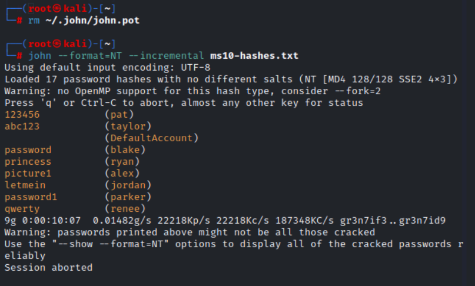
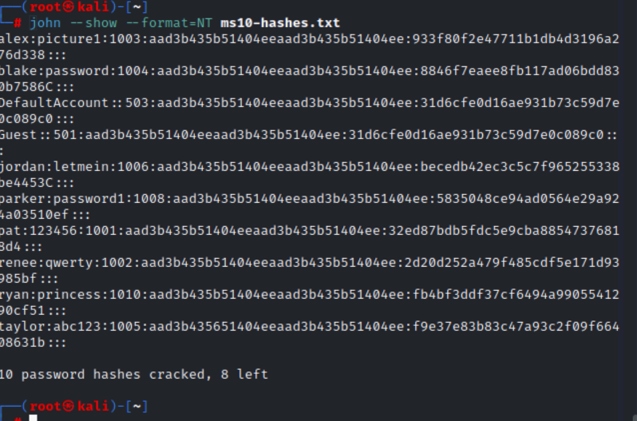
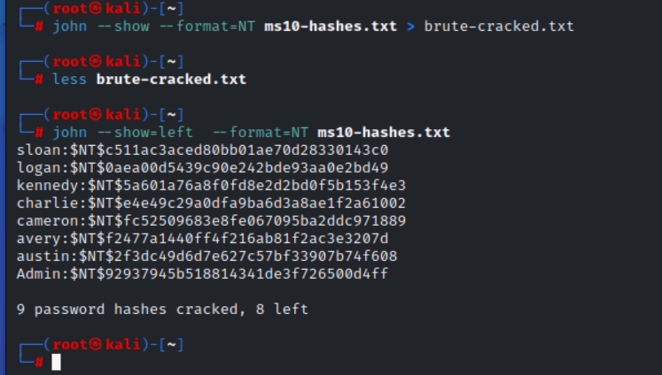
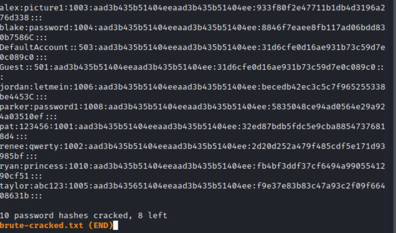
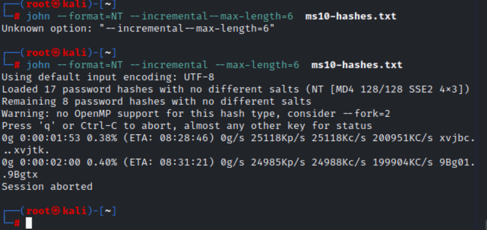
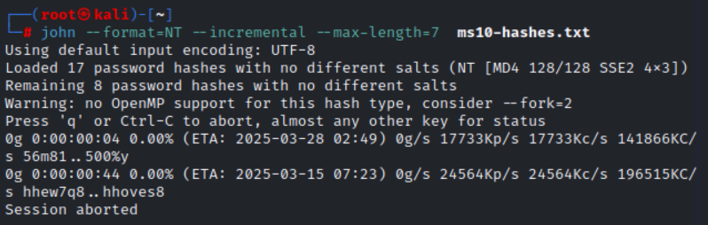

# Brute Force Password Cracking with John the Ripper
---

## Objective  
This lab I, demonstrates the process of performing a **brute-force password attack** using **John the Ripper (JtR)**, an offline password cracking tool. The goal is to crack password hashes from the  windows Virtual machine (MS10 system), highlighting the vulnerabilities of weak or simple passwords. Through this, I  will emphasize the importance of implementing strong password policies to prevent unauthorized access.

---

## Step 1: Clear Cracked Password History  
Before initiating the brute force attack, it’s important to clear the history of previously cracked passwords from your dictionary-based attack. This ensures that we start with a clean slate. Enter the following command:  

```bash
rm ~/.john/john.pot
```

---

## Step 2: Initiate Brute Force Attack  
Now, let’s start the brute force attack using John the Ripper. This method is incremental, meaning JtR will try every possible password combination systematically.  

```bash
john --format=NT --incremental ms10-hashes.txt
```

> **Tip:** You will be prompted with "press almost any other key for status." Press the **SPACEBAR** to view a status update, which will show the progress and elapsed time.

### Expected Results:  
- Quick success with simple, short passwords.  
- Progress will slow down for longer, more complex passwords.  
- Allow the attack to run for 5 minutes or until the password for the `renee` account is cracked.  
- When you're ready to stop the attack, press `q` to exit John the Ripper.

---

## Step 3: View Cracked Passwords  
Once the attack has run for a sufficient amount of time, display the cracked passwords with the following command:  

```bash
john --show --format=NT ms10-hashes.txt
```

> **Note:** Make sure to include the `--format=NT` flag to ensure the correct format.

After running this command, you should see the compromised passwords, as well as the associated user accounts and their hash values.

---

## Step 4: Save Cracked Passwords to a File  
You can save the cracked passwords to a text file for later reference:  


```bash
john --show --format=NT ms10-hashes.txt > brute-cracked.txt
```

To view the saved file, use the `less` command:  

```bash
less brute-cracked.txt
```

> **Navigation tips:**  
> - Press **SPACEBAR** to move to the next page.  
> - Press **b** to go back to the previous page.  
> - Use the **arrow keys** to scroll line by line.  
> - Type **q** to exit the viewer.

---

## Step 5: Display Accounts That Have Not Been Cracked  
To identify which accounts haven’t been compromised yet, run:  

```bash
john --show=left --format=NT ms10-hashes.txt
```

---

## Step 6: Limit the Attack to Shorter Passwords  
Now, let's limit the brute force attack to passwords that are 6 characters or less. This will reduce the range of possible combinations and speed up the process.  


```bash
john --format=NT --incremental --max-length=6 ms10-hashes.txt
```

Press **SPACEBAR** to view the progress. The attack will likely show an **ETA** for completion, but keep in mind that it will take a while, depending on the system’s performance.

---

## Step 7: Run the Attack for 7-Character Passwords  
Next, let's increase the limit to 7 characters. This will significantly expand the password space, and the attack will take much longer. 
 

```bash
john --format=NT --incremental --max-length=7 ms10-hashes.txt
```

### Important Observations:  
- As you increase the password length, the **ETA** will grow substantially, sometimes to the point of showing a date far in the future.  
- If you increase the limit to 8 characters, John the Ripper won’t calculate an ETA since it becomes nearly impossible to estimate.

When you’re done, press **q** to exit the attack.

---

## Conclusion: Best Practices for Password Security  
This brute-force cracking project highlights the importance of using strong, complex passwords. In a real-world scenario, brute force attacks like this would be highly effective against weak passwords. Here’s how to prevent this:

- **Encourage long and complex passwords.** Simple passwords like `password123` or `qwerty` can easily be cracked.
- **Enforce password complexity rules** using security configurations (e.g., requiring a mix of uppercase letters, lowercase letters, numbers, and special characters).
- **Educate users** about the risks of using easily guessable passwords.

