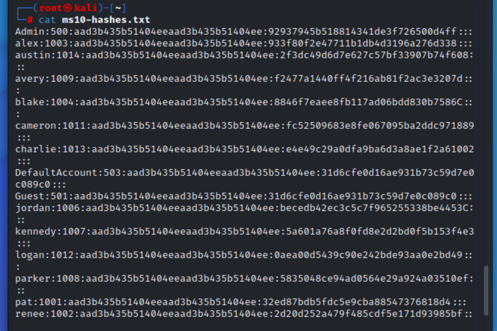
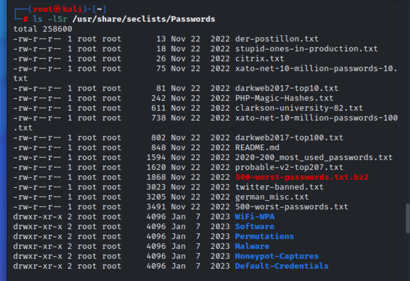
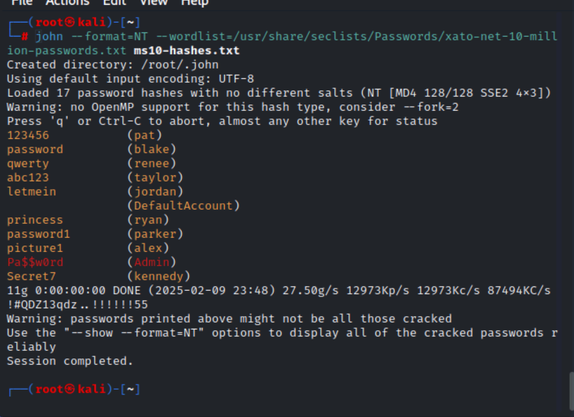
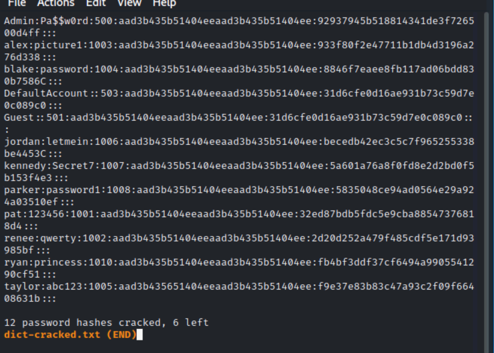

# Dictionary Attack Using John the Ripper
---

## Objective  
In this lab project, I get to  demonstrate the use of **John the Ripper (JtR)** to perform a **dictionary attack** on password hashes. The goal is to understand how easily weak or simple passwords can be cracked, even when strong password hashing algorithms like **NTLM** (NT LAN Manager) are in use. By leveraging offline attacks with large dictionary files, I  will highlight the importance of password complexity and why relying on easily guessable passwords is risky. This exercise aims to reinforce the significance of strong password practices in securing user accounts.

---

## Step 1: Display the Collected Password Hashes  
Before starting the dictionary attack, let’s view the collected user account details and their password hashes from MS10. Enter the following command:  

```bash
cat ms10-hashes.txt
```


 **Note:** The account with a **RID of 500** is the **default administrator account** (`admin`), and the account with **RID 501** is the **Guest account** (often disabled with a blank password by default).

---

## Step 2: List Available Dictionary Files  
Now let’s list all available dictionary files on your system. Enter the following command:  

```bash
ls -lSr /usr/share/seclists/Passwords
```

This will show the directory contents sorted by size, from smallest to largest. The `xato-net-10-million-passwords.txt` file is one of the largest and most commonly used for dictionary attacks. This file contains a list of common passwords and is primarily English-based.

---

## Step 3: Initiate the Dictionary Attack  
We will use John the Ripper to start the dictionary attack against the password hashes. Run the following command to begin:

```bash
john --format=NT --wordlist=/usr/share/seclists/Passwords/xato-net-10-million-passwords.txt ms10-hashes.txt
```

### Explanation of Parameters:  
- `--format=NT` tells JtR to use the NTLM hash format.  
- `--wordlist=...` specifies the dictionary file to use (the list of passwords to try).  

This attack should take just a few seconds, even with the large 10 million password dictionary. JtR will hash each password in the dictionary and compare the results with the target hashes to identify any matches.

---

## Step 4: Review Cracked Passwords  
After the attack runs, view the cracked passwords by entering:  

```bash
john --show --format=NT ms10-hashes.txt
```

> **Note:** Remember to include the `--format=NT` flag to correctly display the results.

You should see a list of the compromised passwords, along with the usernames and their corresponding RID (Relative Identifier) values. Some passwords may still remain cracked, but this attack should successfully break many of the weaker ones.

---

## Step 5: Save Cracked Passwords to a File  
You can save the cracked passwords to a file for easier review later. Enter the following command to export the results:  

```bash
john --show --format=NT ms10-hashes.txt > dict-cracked.txt
```

To view the file, use the `less` command:  

```bash
less dict-cracked.txt
```

### Navigating the File:  
- Press **SPACEBAR** to go to the next page.  
- Press **b** to go back a page.  
- Use the **arrow keys** to scroll line by line.  
- Type **q** to exit the viewer.

---

## Step 6: Display Accounts That Were Not Cracked  
To check which accounts have not been compromised, run the following command:

```bash
john --show=left --format=NT ms10-hashes.txt
```

> **Note:** The discrepancy between the two `--show` operations may arise because accounts with blank passwords are counted as successes in one output but as failures in another.

---

## Conclusion: The Importance of Password Complexity  
This dictionary-based password cracking exercise highlights the vulnerabilities of weak passwords. In a real-world scenario, users may have passwords like “password123” or “welcome” that are easily found in dictionary files. This type of attack shows why users need to create longer, more complex passwords that aren't easily guessable.

### Key Takeaways:  
- **Use strong, unique passwords**: The attack shows how common passwords can be cracked quickly, so encourage the use of complex, random strings of characters.
- **Enforce password policies**: Implementing password complexity requirements can significantly improve security and make brute force or dictionary attacks less effective.
- **Security configurations**: Implement security measures such as account lockouts after a certain number of failed attempts to mitigate these types of attacks.

---
