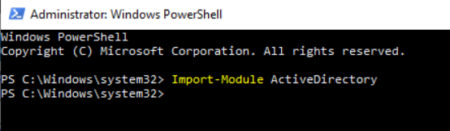
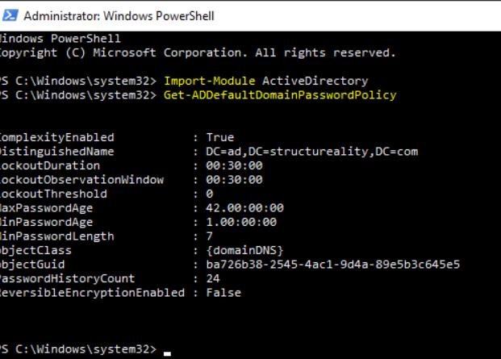
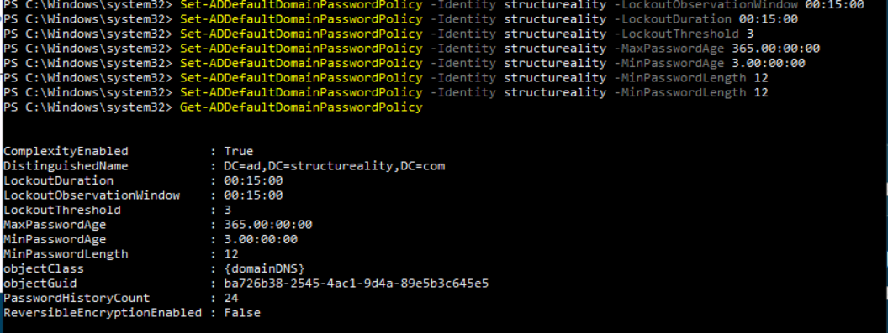

# Setting Password Policies for a Domain
---

## Objective  
In this project,I  will configure a domain-wide password policy for the **Structureality domain** based on insights gathered from previous password cracking and security assessments. By setting stronger password requirements and lockout policies, with aim to enhance overall security, ensuring that user accounts are better protected against brute force, dictionary, and password spraying attacks. This process aligns with the NIST Special Publication 800-63B: **Digital Identity Guidelines** to enforce stronger authentication practices across the domain.

---
## Step 1: Open PowerShell as Administrator  
To begin, we need to open **PowerShell** in administrator mode to modify the Active Directory password policy. Follow these steps:

1. Search for **PowerShell** in the Start menu.
2. Right-click and select **Run as administrator**.
3. In the **User Account Control** window, select **Yes**.

The PowerShell console should now appear.

---

## Step 2: Load the Active Directory Module  
To interact with the domain’s Active Directory, we need to load the **ActiveDirectory** PowerShell module. Enter the following command:

```powershell
Import-Module ActiveDirectory
```

---

## Step 3: View the Current Domain Password Policy  
To view the current password policy settings for the domain, run this command:

```powershell
Get-ADDefaultDomainPasswordPolicy
```

This will display the existing password policy, which will serve as the baseline for the changes we want to make.


---

## Step 4: Implement the New Password and Lockout Policies  
Based on the results of our security assessments (password spraying, dictionary attacks, and brute force attempts), we need to implement the following changes to the **Structureality** domain password policy:

| Key                        | Value         |
|----------------------------|---------------|
| LockoutObservationWindow    | 00:15:00      |
| LockoutDuration             | 00:15:00      |
| LockoutThreshold            | 3             |
| MaxPasswordAge              | 365           |
| MinPasswordAge              | 3             |
| MinPasswordLength           | 12            |

Now, enter the following PowerShell commands to enforce these changes:


```powershell
Set-ADDefaultDomainPasswordPolicy -Identity structureality -LockoutObservationWindow 00:15:00
Set-ADDefaultDomainPasswordPolicy -Identity structureality -LockoutDuration 00:15:00
Set-ADDefaultDomainPasswordPolicy -Identity structureality -LockoutThreshold 3
Set-ADDefaultDomainPasswordPolicy -Identity structureality -MaxPasswordAge 365.00:00:00
Set-ADDefaultDomainPasswordPolicy -Identity structureality -MinPasswordAge 3.00:00:00
Set-ADDefaultDomainPasswordPolicy -Identity structureality -MinPasswordLength 12
```

### Explanation of Time Format  
- **D:H:M:S.F**: Represents days, hours, minutes, seconds, and fractions of a second.  
  - `D` = Days (0 to 10,675,199)
  - `H` = Hours (0 to 23)
  - `M` = Minutes (0 to 59)
  - `S` = Seconds (0 to 59)
  - `F` = Fractional seconds (0 to 9,999,999)

These commands will adjust the password policy settings to enforce stronger password complexity and lockout settings.

---

## Step 5: Verify the New Password Policy  
After implementing the changes, you can verify the updated password policy by running:

```powershell
Get-ADDefaultDomainPasswordPolicy
```

This command will display the new password policy settings to ensure that all changes have been applied successfully.

---

## Step 6: Enforce Password Complexity for Existing Users  
While existing passwords will remain in place and may not meet the new complexity requirements, users will be required to change their passwords once they log in. You can force users to update their passwords at their next login by using the following commands:

1. **Remove password expiration exemption (if set):**

```powershell
Get-ADUser -Filter * | Set-ADUser -PasswordNeverExpires $False
```

2. **Force users to change their passwords at next logon:**

```powershell
Get-ADUser -Filter * | Set-ADUser -ChangePasswordAtLogon $True
```

These commands ensure that once users log in next, they will be required to change their passwords to meet the new complexity requirements.

---

## Conclusion: Strengthening Domain Password Policies  
By implementing a strong domain-wide password policy, including increased password length and lockout thresholds, we can significantly improve the security of user accounts. These changes align with the best practices outlined in the **NIST 800-63B guidelines** for digital identity management.

### Key Takeaways:  
- **Password Complexity**: Enforcing minimum password lengths (e.g., 12 characters) reduces the effectiveness of brute force and dictionary attacks.
- **Lockout Policies**: Locking accounts after a limited number of failed login attempts prevents password spraying and brute force attacks.
- **Password Expiration**: Encouraging regular password changes ensures that even if a password is compromised, it won't remain valid for long.

By proactively managing password policies and enforcing strong security configurations, you can safeguard your organization against common threats and enhance overall system integrity.

---